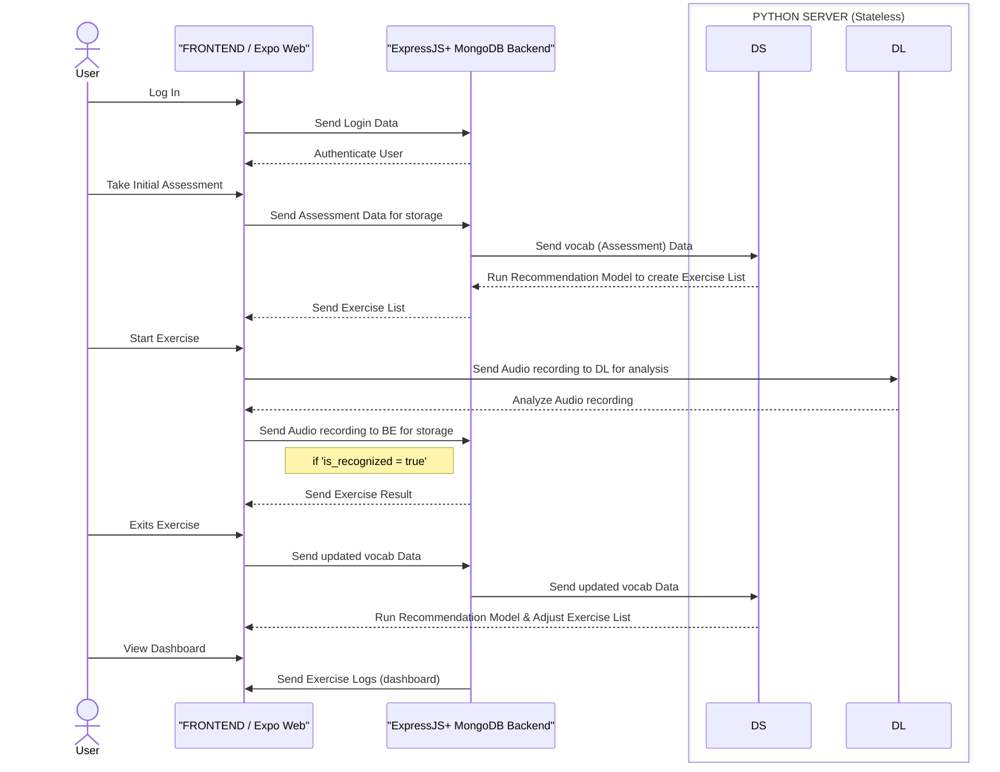

```mermaid
sequenceDiagram
    Actor User as User
    participant FE as "FRONTEND / Expo Web"
    Participant BE as "ExpressJS+ MongoDB Backend"
box PYTHON SERVER (Stateless)
    participant DS
    participant DL
end

    User ->> FE: Log In
    FE ->> BE: Send Login Data
    BE -->> FE: Authenticate User

    User ->> FE: Take Initial Assessment
    FE ->> BE: Send Assessment Data for storage
    BE ->> DS: Send vocab (Assessment) Data
    DS -->> BE: Run Recommendation Model to create Exercise List
    BE -->> FE: Send Exercise List

    User ->> FE: Start Exercise
    FE ->> DL: Send Audio recording to DL for analysis
    DL -->> FE: Analyze Audio recording
    FE ->> BE: Send Audio recording to BE for storage
    Note left of BE: if 'is_recognized = true'
    BE -->> FE: Send Exercise Result


    User ->> FE: Exits Exercise
    FE ->> BE: Send updated vocab Data
    BE ->> DS: Send updated vocab Data
    DS -->> FE: Run Recommendation Model & Adjust Exercise List

    User ->> FE: View Dashboard
    BE ->> FE: Send Exercise Logs (dashboard)


```
