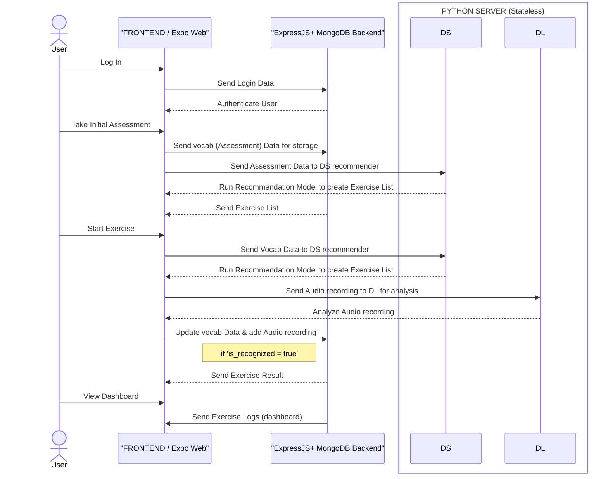

**Talk-a-Palooza is ...**

<h5 align="center">
  
  <a href="#UX-Process">UX-Process</a>  |
  <a href="#Frontend">WD Frontend</a>  |
  <a href="#Backend">WD Backend</a>  |
  <a href="#data-science">Data Science</a>  |
  <a href="#deep-learning">Deep Learning</a>  |
  <a href="#Summary">Summary</a>
  
</h5>

# UX-Process

### Personal Impresions :bricks::smiley:

It wasn't as easy as I thought to apply what I learned in practice. I soon realized that even the smallest steps, no matter how obvious they may seem, are crucial to achieving a good result. I learned that being attentive to the details is a must when you are a first-time designer dealing with Figma, UX processes, and research. Skipping steps can lead to a result that is only visible at the end and difficult to change. Moreover, it often requires double the amount of time to fix. The main takeaway from this experience is never to underestimate any required steps in the UX world.

### Problems :exploding_head::boom::building_construction:

Along with the technical problems I faced while using Figma and its features, I also encountered other issues along the way. This brings me to the second big lesson from this project phase: communicating effectively. I felt stuck and unsure of what to do at times because of my lack of experience and not knowing what was happening in the other tracks, mostly due to my lack of knowledge about the tasks they were doing. One problem I faced was not realising that I had to proactively go to every track to ask about all the functions and doable possibilities. I found myself assuming or waiting for directions, which was not helpful.

### Results and plan :european_castle::hugs::yellow_heart::sparkles:

Whit more organisation the plan came to an end. We had to take decisions together. For example, the initial assessment. We brainstormed together between tracks to determine the kind of information we needed from the user to make our platform work effectively. Categorizing the data we gathered was also a significant challenge we had to overcome. I still encountered many blocks while designing and perceive I need to keep learning, reading and doing to gain more capabilities. It was overall a very good first impression of the UX designer work and I am looking forward to gaining more experience in this area.

Thank you for the opportunity Techlabs :+1:

&nbsp;
&nbsp;

# Web Development

## Frontend

#### React Framework: React Native with Expo

[Expo](https://expo.dev/) is an open-source platform for making universal native apps for Android, iOS, and the web with JavaScript and React.
It is used by top companies worldwide, serving hundreds of millions of end users.
Expo was the obvious go-to solution as the app is destined to be a mobile app, yet I needed to be able to present a web version for the demo.

> As of now, my focus has been 100% on the web side, and so the code is still to be adjusted to be used on android and iOS devices.

#### UI Framework: TailwindCSS

Here the choice was a bit more delicate. As I was working with a React Native app, I explored several options popular amongst React Native developers.

Amongst others, [Tamagui](https://tamagui.dev/) looked very promising and is highly acclaimed amongst the community. Yet, after exploring their _not-so-intuitive_ documentation, I realized very quickly that I would not be able to get a hand of the framework within the timeline given for the project, and especially given that I was in charge of developing both the frontend and the backend.

Ultimately, I decided to opt for [TailwindCSS](https://tailwindcss.com/) since it is a widely adopted UI framework both with the React and React Native community. Also, TailwindCSS is pretty simple to start with, so I could quickly digest the basics to get going.

Now that I implemented most of my UI with it though, I find the string tree in classNames pretty cluttered, so I believe you actually need to get a more advanced grasp of it to make the most of this framework.

I would have **LOVED** to build the whole UI design system with [storybook](https://storybook.js.org/) from the start, it would have been such a time-saver ultimately as well as reducing the technical debt, unfortunately given the workload on my desk, I could not even get started on it. This is though one of the very first task I will accomplish when developing the project further.

#### Dependencies

Amongst other dependencies, I used the following :

- **Axios**: To create HTTP Request
- **React Router**: for routing in React
- **Lottie**: Developped by Airbnb, Lottie is an iOS, Android, and React Native library that renders incredibly lightweight After Effects animations in real time. I used it to display various animated characters and user interactions elements.
- **Nivo**: nivo provides a rich set of dataviz components, built on top of D3 and React. It is an incredible tool really easy to work with.
- **Formik and yup** to facilitate the handling of forms setup and validation

### Highlights:

#### Conditional Screens Rendering:

As I envisioned from the beginning to keep developing the app further, I did not take any shortcuts regarding the business logic and tried to envision many different scenarios, even though they were guaranteed to never show at this stage of the MVP:

- what if the user is interrupted during the child registration process and loads the page again later?
- what if the user tries to reach a protected page while being logged out?
- what if the user wants to add many children to the app?
- the app is destined to be mobile: how can I reduct the technical debt by creating as few screens / pages as possible and reduce the using of URL routing (concept which does not exist on mobile apps)
- ..etc...

| Example of conditional rendering on AddChild component | Example of conditional rendering on AddWords component |
| -- | -- |
|  |  |

All those scenarios, although invisible to the eye, allowed me to build a frontend with a solid business logic for the next developments.

#### Animations (dotLottie + handmade animation)

A [Lottie](https://lottiefiles.com/) is a JSON-based (or.lottie) animation file format that allows you to ship animations on any platform as easily as shipping static assets. They are small files that **work on any device** and can **scale up or down without pixelation**.

And they were so ~~fun~~ ~~frustrating~~ fun to work with!

Fun, because the files are so lightweight (some of the lotties I used **weight as little as 4KB** !!!
Frustrating, because there are numerous npm packages for react:
lottie, react-lottie, lottie-react-native, lottie-web, @lottiefiles/react-lottie-player, react-lottie-player, @lottiefiles/lottie-player, @dotlottie/player-component, @dotlottie/react-player
It is really difficult to figure out which one is appropriate for a Expo React Native Web project, how well maintained the package is...etc... Even the official lottieFiles documentation is outdated.

I must have tried at least 4 different packages before opting for @dotlottie/react-player, although serving a couple of warnings and probably incompatible for Android and iOS.

I also built my **very first handmade (pun intended) animation**, by making the adult hand with the heart reaching to the child's hands:

A very enriching and fun experience !

#### API services & Wrappers

As we will see in the backend section the particularity of this project in terms of web development is the number of API endpoints required at a MVP stage.

Examples of API endpoints: for children and vocabulary management:

| children Service | vocablogs Service |
| -- | -- |
|  |  |

Working on both end of the stick was particularly challenging, as I struggled at first to identify whether the bugs were coming from the frontend or the backend. After writing down a personal methodology, and going back to the "baby steps" philosophy, things got much easier afterwards.

#### Audio feature management

Last but not least, the audio feature management!
Working with audio was also a first-time for me, but it ended up going much more smoothly than expected.

| RecordPlayAudio | recording Service |
| -- | -- |
|  |  |

#### Fidelity to design

When integrating a design in frontend comes always a moment where we have to choose between design fidelity and respect of web principles / cohesive system design.
Unfortunately on this project I ended up having to sacrifice a lot of the fidelity, to maintain a pleasant and cohesive design. Although I did not setup storybook, I built the UI on the principles of isolated UI elements, and so when a similar element appeared (for example typography, headings, background styles...), I chose to favor consistency by reusing the previously coded elements.
Ultimately, the frontend design is cohesive and follows web principles, but unfortunately largely far from the original planned design.

** frontend designs **
startscreen:
initial assessment:
exercise:
dashboard:

#### Current limitations and what's next

The todo list is of course never ending, but as of now, here are the main points I will be working on next:

- **Transition to typescript**: it has been a few months that I want to learn Typescript, and it feels like this is the right moment to do so.
- **Storybook**
- **Test-driven development** : just like storybook, it feels a must-have to reduce technical debt
- **Android / iOS**: a lot is left to be debugged / adapted to be compatible.

## Backend

The development process of the backend was challenging especially as I was constantly switching between backend and frontend tasks. Nevertheless, I managed to develop the backend to a stage where it nicely connects to the frontend, deep learning and data science API and the data is displayed as intended. The backend is built with ExpressJS and MongoDB.

### Initial project phase - server setup and user auth:

In the beginning I focussed on getting the server up. This went pretty easily, so I decided to take a step back and think about the data structure and API flows of the app. I created a mermaid diagram to visualize the data structure and the API flows. This was very helpful to get a clear picture of the work ahead.

I also started immediately with the user authentication endpoints, because that was going to be needed as a basis for the user flow in the app.
Our mentors advised against spending too much time on the user authentication, so I decided to setup a oAuth2 authentication with Google. This was a good decision, because it was pretty easy to setup and I could focus on the other tasks. The provided user endpoints as of now enable the user to signup/login with google and logout of the app through the dashboard.

Next, I worked on my different models:

- user
- child
- vocablogs
- recordings (audio)
- wordBank database

I had a rought previous knowledge of relational database, so the freedom that comes with nonSQL DB gave me also a bit of difficulty making decisions between embedding or referencing collections, for example. I had to undo / redo some of my work, but I think I have a good understanding of the data structure now.

### Development of the vocablogs and recordings endpoints:

Once the data structure was defined, I worked on the vocablogs and recordings endpoints. This was challenging because I had to figure out how to store the audio files in the database.
I decided to store the audio files in a separate collection and reference them in the vocablogs collection. This way, I can easily access the audio files and the vocablogs separately.
Also, I decided to store only recordings that were recognized by the deep learning model. This way, I can easily filter out the recordings that were not recognized, only display the recognized recordings in the dashboard and not overload the database with useless audio files.

### Examples of controllers:

| vocablogs | recordings |
| -- | -- |
|  |  |

#### Examples of DB entry:

| child | vocablog |
| -- | -- |
|  |  |

#### Example of a recording DB entry:

&nbsp;

At the moment, we have not implemented the connection for the dashboard to the backend, so the data is not displayed yet.
As well, I decided against trying to deploy the app, both by lack of time, and because the app itself will ultimately be a mobile app and not webapp.

**webdev by [Rose](https://github.com/rjeantet)**

# Data Science

### Intro

The promise of personalised experiences extends well beyond the consumption-based ventures it is typically associated with. Our team aimed to integrate this concept into our app, ecognising the significant potential that personalisation holds for enhancing educational tools. Developing a strategy to provide personalised word recommendations for the app's ronunciation exercises was our track's primary focus.

### The data

The Wordbank dataset, offering a wealth of linguistic data related to children's language development, provided the foundation for our track's contribution to the project. In a crucial irst step, we conducted preliminary explorations of the dataset. These explorations not only clarified to us which of the project's original goals were actually achievable and which were ot, but also offered insights into the linguistic trajectories of our app's target audience: young children.

### Two models, one goal

Subsequently, we delved into research on recommendation models, particularly focusing on collaborative filtering techniques. Drawing from our research findings, we went on to create two ifferent models: a graph-based LightGCN model and a memory-based KNN model, each offering distinct advantages and disadvantages. Both models were successfully deployed and offer API ntegration.

&nbsp;

# Deep Learning

&nbsp;
&nbsp;

# Summary
