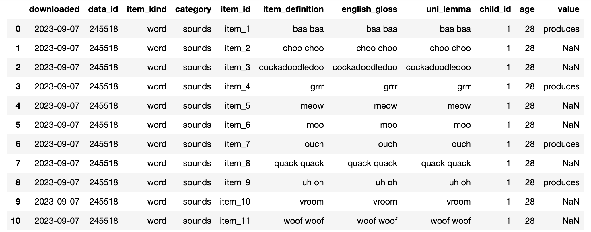
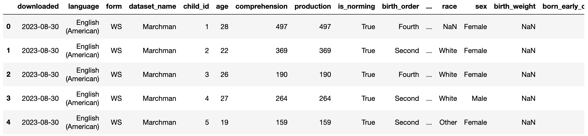

# 1 - DATASET

## 1.1 - Wordbank database: An open database of children's vocabulary development

**What is Wordbank?**

It is a research initiative that aims to collect data on vocabulary development in children of different ages. It is a source of valuable information for researchers, educators, and speech and language professionals who want to understand how children learn words and build their vocabularies.

**What does Wordbank do?**

The main purpose of Wordbank is to collect data on children's vocabulary across different languages and ages. It allows researchers to study children's vocabulary growth over time and identify patterns of word acquisition across different languages and cultures. Wordbank collects specific information about what words children know and when they acquire them, which is fundamental to the study of language development.

**How does Wordbank work?**

Wordbank works by collecting data from surveys that evaluate the vocabulary of children in different age groups. Researchers collect information about the words that children know and are able to use in their daily interactions. This data is then compiled and made available in an accessible format for analysis.

Wordbank is open and collaborative, meaning researchers can contribute their own data to enrich the database. This allows other researchers to share information and compare results from different language development studies around the world.

## 1.2 - Datasets architectures:
    
### 1.2.1 -  Full Child_by_Word Data
Download Link: http://wordbank.stanford.edu/data?name=instrument_data

**Dataset structure:**

Each line represents a word (item_id) that a child pronounced or not pronounced (`child_id`). In other words, several lines can represent a single child, and the set of words that this child is able to speak.

The columns represent the characteristics of the words and the children, such as: age (from 16 to 30 months of age), and whether or not they produce the word.

**Dataset:** 

**Characteristics of the dataset for ML model:**

To train the ML model, the dataset was used, with the following characteristics:

- Language: American English
- Form: WS - Words and Sentences ("toodler") format.

### 1.2.2 - By_Child Summary:
Download Link: http://wordbank.stanford.edu/data?name=admin_data

**Dataset structure:**

This dataset contains information about each child, such as gender, age, and development.

**Dataset:**

**Characteristics of the dataset for ML model:**

To train the ML model, the dataset was used, with the following characteristics:
- Language: American English
- Form: WS - Words and Sentences ("toodler") format.
- Health Conditions: All
- Language Status: All
- Age: 16 - 30 Months

# 2 - MACHINE LEARNING MODEL:

**Input:** words the child speaks.

**Output:** set of words that the child could speak, in addition to those passed on in the input.

The objective of the model is to return a set of words that a child at a given age should speak. In research, we arrived at recommendation models. 

## 2.1 - Recommendation Models:

### 2.1.1 - Collaborative filtering: is a recommendation algorithm that suggests items based on the preferences and behaviors of similar users.

We used the library [LibRecommender](https://librecommender.readthedocs.io), which implements many different recommendation models, including Collaborative Filtering. It is an easy-to-use recommender library focused on end-to-end recommendation process.

**Observation:** After further analysis of the recommendation models, it was decided to test with the LibRecommender library, mainly because the application can receive new users, so "Supports cold-start prediction and recommendation" is a necessary feature for the model.

## 2.2 LibRecommender

Homepage: https://librecommender.readthedocs.io/en/latest/index.html

- A hybrid recommender system, which allows users to use either collaborative-filtering or content-based features. New features can be added.  - - Implements several models, like YouTubeRanking, 
- Supports dynamic feature and sequence recommendation, 
- Supports cold-start prediction and recommendation, 
- Easy to retrain models with new users/items from new data.  

LibRecommender offers two distinct model categories:
- Pure Models: These models exclusively consider user-item interactions and draw inspiration from the Collaborative Filtering paper.
- Feat Models: These models additionally incorporate user and item features. Examples of such features include user age and movie genre.

The library boasts a variety of algorithms, including LightGCN (a pure model) and Wide & Deep (a feat model).
Link to LightGCN - https://librecommender.readthedocs.io/en/latest/api/algorithms/lightgcn.html 

More informations: https://github.com/TechLabs-Berlin/ss23-talk-a-palooza/blob/main/notebooks/ds/explore_librecommender.ipynb
