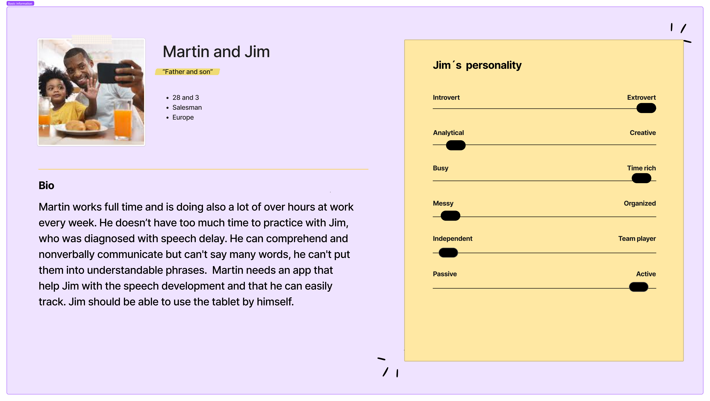
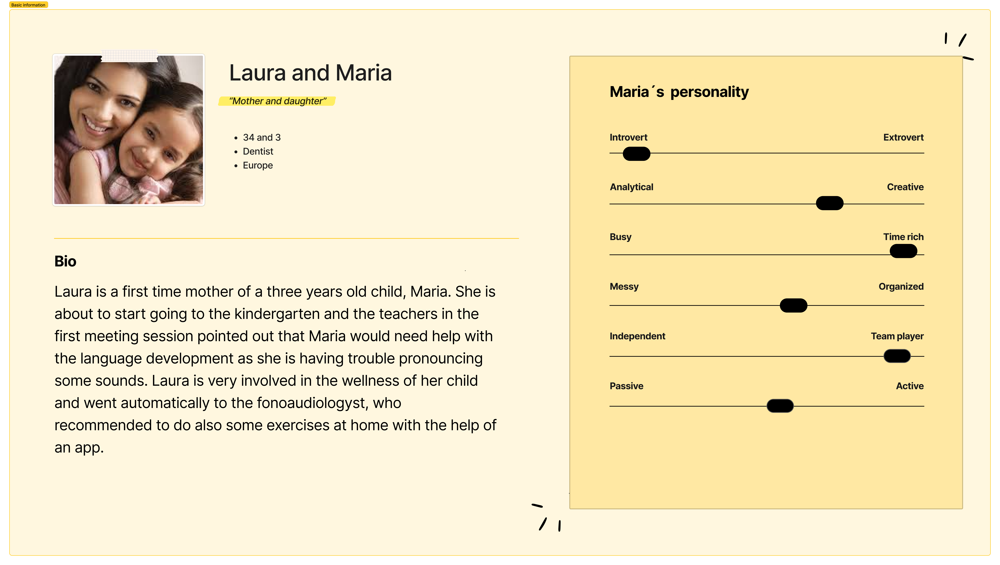
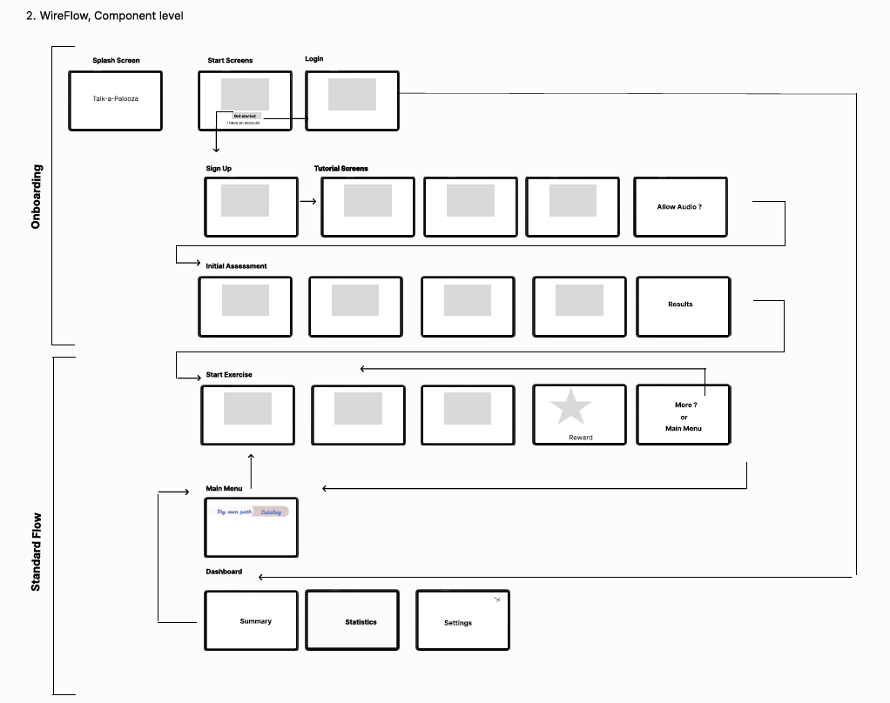
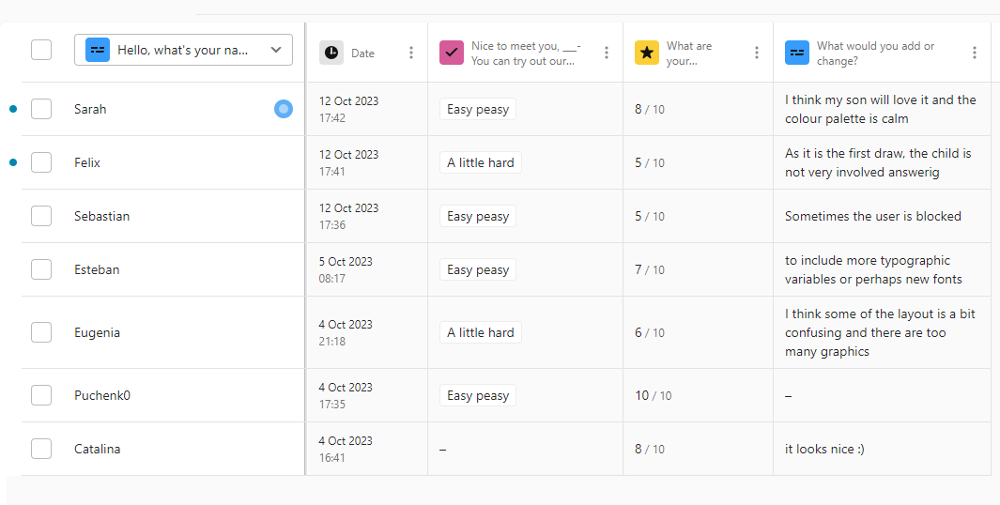

# User Research: Stories, Personas, Scenarios

## Personas:

* Martin and Jim
  

**Scenario:**

Martin arrives home after a long day at the office, where he had to work an extra two hours to finish an important project. Waiting for him at home is his three-year-old son, Jim, who is staying with him for the week.
The nanny leaves, leaving Martin and Jim alone together. Jim wants something to eat from the kitchen, but he is only able to point and gesture to communicate his desire. 
This is a recurring issue. Now Martin has to show Jim many different food items before he can confirm what it is that he wants. 
Remembering that his child needs help developing language, Martin picks up his tablet and continues their learning path in the "Talk-a-Palooza" app. After doing some exercises together, Martin is able to return to the kitchen and cook dinner while Jim practices with the app.

* Laura and Maria 

**Scenario:**

Maria is a three-year-old child who is starting kindergarten this year. After her first session with the speech therapist, recommended by her future teachers, she feels frustrated because she cannot pronounce certain sounds correctly. 
Unfortunately, a thirty-minute session with the therapist is not enough. Her mother, Laura, decided to download an app to complement the therapy and speed up Maria's development.
Laura starts practicing some difficult sounds with Maria, repeating them until Maria notices that she is pronouncing the correct sound. Maria is happier and more motivated now. 
In addition, after finishing some exercises, she can watch funny videos and dance, which she loves. She spends some time with the app until it's time to put away technology for the day. 
She goes to sleep looking forward to meeting her new friends the next day.

# User Flow through App

# Interactive Figma Prototype

https://www.figma.com/proto/e04DLsVxMRcCBD2USBA0UT/Talk-a-Palooza-Design-System?type=design&node-id=391-46367&t=c3YqWcihDCBLlyIY-9&scaling=scale-down&page-id=0%3A1&starting-point-node-id=391%3A46367&show-proto-sidebar=1

# User Testing of your Prototype
https://42qei34afqy.typeform.com/to/s3el48Bo?typeform-source=github.com

