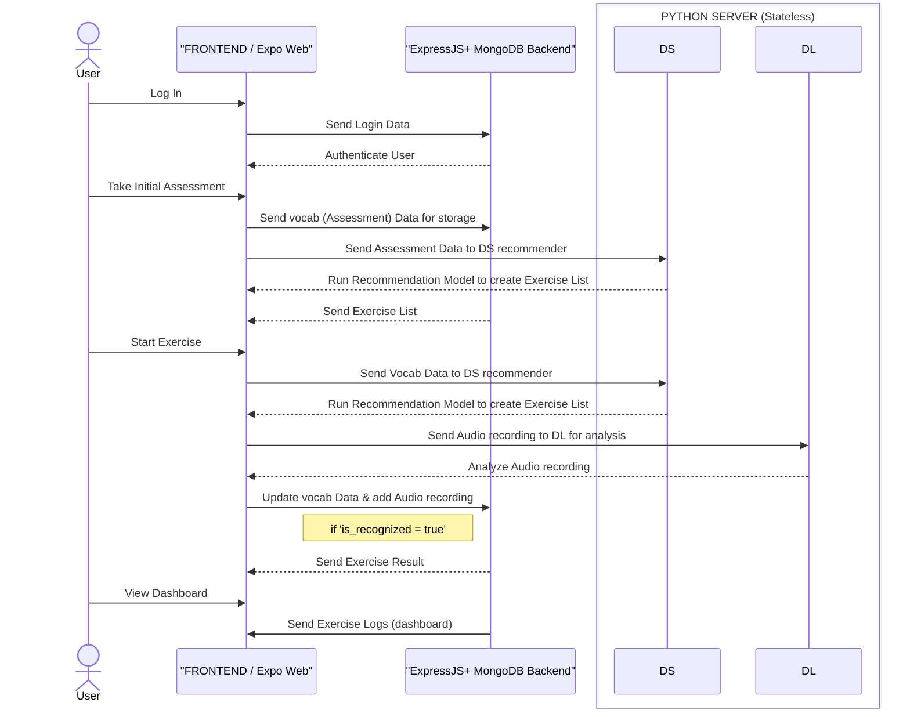

```mermaid
sequenceDiagram
    Actor User as User
    participant FE as "FRONTEND / Expo Web"
    Participant BE as "ExpressJS+ MongoDB Backend"
box PYTHON SERVER (Stateless)
    participant DS
    participant DL
end

    User ->> FE: Log In
    FE ->> BE: Send Login Data
    BE -->> FE: Authenticate User

    User ->> FE: Take Initial Assessment
    FE ->> BE: Send vocab (Assessment) Data for storage
    FE ->> DS: Send Assessment Data to DS recommender
    DS -->> FE: Run Recommendation Model to create Exercise List
    BE -->> FE: Send Exercise List

    User ->> FE: Start Exercise
    FE ->> DS: Send Vocab Data to DS recommender
    DS -->> FE: Run Recommendation Model to create Exercise List
    FE ->> DL: Send Audio recording to DL for analysis
    DL -->> FE: Analyze Audio recording
    FE ->> BE: Update vocab Data & add Audio recording
    Note left of BE: if 'is_recognized = true'
    BE -->> FE: Send Exercise Result

    User ->> FE: View Dashboard
    BE ->> FE: Send Exercise Logs (dashboard)


```
